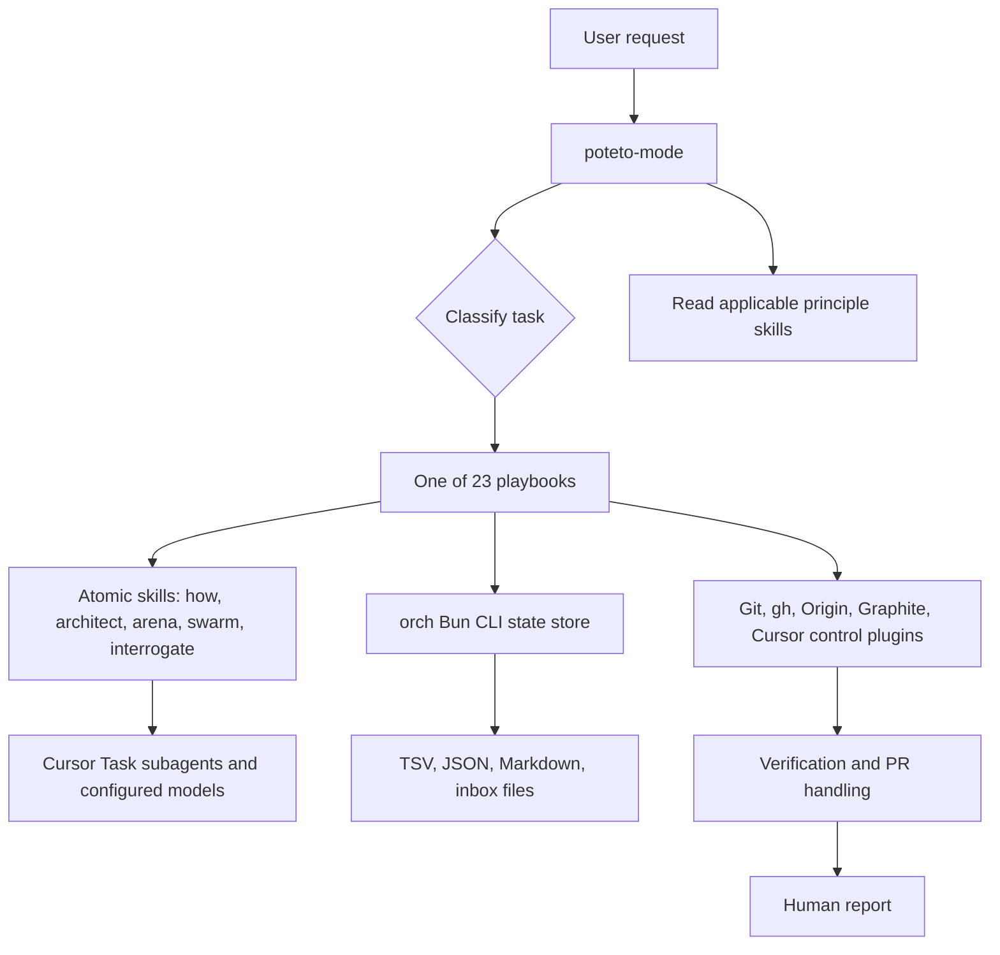

# pstack implementation audit

## Scope and method

This audit covers the 124 files added by commit `6c57632` (`added pstack`): two agents, 47 skills, 23 playbooks, 21 tooling files, and 31 supporting reference files. It compares those files with this repository's architecture and operating rules in [readme.md](../readme.md) and [.github/copilot-instructions.md](../.github/copilot-instructions.md).

The upstream framework is a Cursor plugin. Its design is documented by the [pstack Plugin | cursor/plugins | DeepWiki](https://deepwiki.com/cursor/plugins/3.4-pstack-plugin). This repository contains a vendored copy of pstack content under `.github`, not an installed Cursor plugin.

## Executive assessment

pstack has two distinct layers:

1. A portable engineering layer: focused scope, explicit verification, domain modelling, root-cause fixes, and behavior-focused tests.
2. A Cursor runtime: `Task` subagents, role-specific models, Cursor transcript storage, Cursor Routines, `/loop`, companion Cursor plugins, Bun scripts, and command-line PR tooling.

The first layer is broadly applicable to Enablemint Builder. The second layer does not run as written in either VS Code agent mode or GitHub Copilot cloud agent and contains assumptions that conflict with this repository:

- The repository's default branch is `master`; some pstack scripts assume `main`.
- The project requires interactive planning before implementation; pstack's autonomy rules direct agents to proceed on reversible work without asking.
- Copilot cloud agent supports custom-agent delegation, but not Cursor `Task` options, background flags, or configured model-role slugs.
- Local development uses Windows and PowerShell, while Copilot cloud agent runs in a GitHub Actions environment. Several helpers support only Bash and assume unavailable Cursor state.
- The project uses Azure DevOps work-item integrations and GitHub Actions. pstack assumes Cursor-native PR orchestration, `gh`, optionally Origin and Graphite, and external Cursor plugins.

Use pstack through the manually selected cloud profile described in the [Copilot integration guide](pstack-copilot-integration.md). The [compatibility skill](../.github/skills/pstack-copilot/SKILL.md) preserves repository precedence and quarantines runtime dependencies that have not been ported.

## Architecture

`poteto-mode` is the control plane. It maps a user request to a playbook, forces a set of principles and skills, and defines the default subagent policy. Playbooks describe task lifecycles. Atomic skills provide discovery, design, review, delegation, and reflection. The `orch` CLI persists state only for the long-lived Orchestrate workflow.

## Agents

| Artifact | What it does | How it participates | Compatibility |
| --- | --- | --- | --- |
| [poteto-agent.md](../.github/agents/poteto-agent.md) | Wrapper for the pstack style. It requires every delegated agent to read `poteto-mode` before work. | `poteto-mode` requires this as the subagent type for ordinary delegated work. | Not portable as written. Copilot supports custom-agent delegation, but this profile declares a Cursor-specific `is_background` property and embeds Cursor routing assumptions. |
| [comment-sicko.md](../.github/agents/comment-sicko.md) | Read-only review persona that identifies comments to delete and symbols that need a clearer design. | Invoked by `no-comments`. | Technically portable but unsuitable as default policy. Its categorical deletion stance conflicts with existing project guidance that permits concise explanatory comments. |

## Core orchestrator

[poteto-mode/SKILL.md](../.github/skills/poteto-mode/SKILL.md) is both style guide and dispatcher.

- It activates for `/poteto-mode` or a request to use that style.
- It classifies each task and selects a playbook.
- It requires agents to read applicable principle skills and report which principles changed their choices.
- It routes discovery to `how`, design to `architect` or `arena`, review to `interrogate`, concurrent work to `swarm`, and long-running work to `show-me-your-work`.
- It directs ordinary code delegates to use Cursor's `Task` tool with `poteto-agent`, background execution, and named model roles.
- It sends PR work to Babysit or Shipping and relies on Cursor's `/loop` for persistent automation.

This makes pstack intentionally prescriptive. Its non-negotiable workflow is incompatible with a repository that already owns routing through [.github/copilot-instructions.md](../.github/copilot-instructions.md), solution-specific agents, and an interactive planning rule.

## Playbooks

The playbooks live in [poteto-mode/playbooks](../.github/skills/poteto-mode/playbooks). They are selected by `poteto-mode`; they do not execute independently.

| Playbook | Lifecycle | Major dependencies and risks |
| --- | --- | --- |
| `investigation` | Gather evidence, explain a read-only answer. | Generally portable after replacing Cursor tool names. |
| `bug-fix` | Reproduce, find root cause, change, verify. | Portable process; use the repository's focused test commands. |
| `perf-issue` | Capture a baseline, diagnose, improve, measure. | Portable only with repo-specific observability and profiling tools. |
| `hillclimb` | Iterate against one measured target and keep accepted improvements. | Requires durable logs and measurement harnesses. |
| `runtime-forensics` | Diagnose live runtime behavior without fixing it. | Assumes live instrumentation and often Cursor control tools. |
| `trace-forensics` | Analyze a supplied trace or profile artifact. | Portable if the trace format and tooling are supplied. |
| `feature` | Discover, architect, delegate implementation, verify, and open a PR. | Forces subagent delegation and a PR lifecycle even for modest changes. |
| `refactoring` | Preserve behavior while changing structure. | Portable process; delegation is Cursor-specific. |
| `prototype` | Build a throwaway experiment to settle an empirical choice. | Portable idea; needs project-local launch and test instructions. |
| `visual-parity` | Compare two UI implementations pixel-for-pixel. | Requires a screenshot harness and browser control. This repo has Playwright but no pstack control skill. |
| `authoring-a-skill` | Create or revise a `SKILL.md`. | Assumes Cursor's built-in `create-skill`. |
| `eval` | Evaluate whether a prompt or skill change improves behavior. | Requires a repeatable evaluation harness. |
| `babysit` | Drive PRs through conflicts, review, CI, and merge readiness. | Depends on `gh` or Origin, Cursor `/loop`, and pstack's PR state model. |
| `shipping` | Independently verify and merge a contiguous stack of PRs. | Depends on GitHub/Origin CLIs, independent Cursor cloud agents, and optional Graphite stacks. |
| `autonomous-run` | Repeatedly work until an explicit exit predicate is satisfied. | Assumes `/loop` or a watcher and unattended execution. |
| `orchestrate` | Run a multi-day program with many agents and stacked PRs. | Depends on Cursor `Task`, cloud/local agents, Bun `orch`, Graphite, and persistent Cursor storage. |
| `autopilot-full` | Own several independent PRs through merge. | Requires an automated PR and reviewer workflow. |
| `autopilot-stack` | Build a linear reviewed stack for a human to merge. | Requires stack topology and PR tooling. |
| `session-pickup` | Reconstruct and continue previous agent work. | Assumes Cursor transcripts and agent identifiers. |
| `pause-safely` | Persist enough state for a clean later resume. | Portable only after a repository-specific state location is defined. |
| `multi-phase-plan` | Plan a multi-phase or multi-PR effort. | Portable method; current repo also has a spec-driven workflow. |
| `worktree-cleanup` | Classify and prune stale worktrees or simulators. | Helper script assumes Bash, macOS/Linux utilities, Cursor transcripts, and `origin/main`. |
| `opening-a-pr` | Open a PR after another playbook completes. | Requires GitHub CLI or Origin workflow. |

## Atomic and support skills

The following are the non-principle skills added by pstack. The table describes the responsibility of every skill and the change needed for this repository.

| Skill | Function | Repository disposition |
| --- | --- | --- |
| [architect](../.github/skills/architect/SKILL.md) | Builds competing type and module sketches, then drives implementation from a selected design. | Retain only for substantial cross-boundary changes. Replace mandatory model bakeoffs with the available `runSubagent` agents. |
| [arena](../.github/skills/arena/SKILL.md) | Runs parallel candidate implementations and selects or grafts a winner. | Port only if multi-agent comparison is valuable. It requires configured Cursor model pools. |
| [automate-me](../.github/skills/automate-me/SKILL.md) | Mines transcripts and asks preferences to create a personal mode skill. | Do not use unchanged. It reads `.cursor` paths and relies on Cursor's `create-skill`. |
| [blast-radius](../.github/skills/blast-radius/SKILL.md) | Maps likely impact before a change and requests one real safety check. | Retain as optional review guidance, mapping code navigation to VS Code reference tools. |
| [bro](../.github/skills/bro/SKILL.md) | Restates the previous message in plain language. | Optional, low value for repository automation. |
| [create-verification-skill](../.github/skills/create-verification-skill/SKILL.md) | Creates an app-driving verification skill and feature map. | Adapt to Playwright, backend tests, and VS Code tools; do not write `.cursor/skills`. |
| [figure-it-out](../.github/skills/figure-it-out/SKILL.md) | Designs an auditable custom playbook for a large effort. | Retain as a lightweight planning pattern, but prefer existing specs for product work. |
| [how](../.github/skills/how/SKILL.md) | Explains runtime flow, ownership, and placement. | Portable and useful. Replace its Cursor task assumptions with local search, code navigation, and suitable subagents. |
| [interrogate](../.github/skills/interrogate/SKILL.md) | Runs adversarial multi-model review and synthesizes findings. | Adapt to one or more available review agents; do not promise model diversity unavailable in Copilot. |
| [maintain-verification-skill](../.github/skills/maintain-verification-skill/SKILL.md) | Refreshes a project-local verification skill through source inspection and live testing. | Adapt after establishing a real verification skill and Windows-compatible commands. |
| [make-bot-ui](../.github/skills/make-bot-ui/SKILL.md) | Creates a UI that wakes a Grok Bot using Cursor Routines and Tailscale. | Remove unless this becomes a deliberate product capability. It is unrelated to the current solution. |
| [no-comments](../.github/skills/no-comments/SKILL.md) | Invokes Comment Sicko and applies accepted recommendations. | Do not make this default. Existing coding standards are the safer comment policy. |
| [recall](../.github/skills/recall/SKILL.md) | Rebuilds current context from transcripts, workspace state, and shared records. | Adapt to VS Code session memory and repository state. |
| [reflect](../.github/skills/reflect/SKILL.md) | Mines an active transcript with parallel reviewers and turns findings into skill changes. | Do not use unchanged. It depends on Cursor transcript layouts, `Task`, models, and `create-skill`. |
| [setup-pstack](../.github/skills/setup-pstack/SKILL.md) | Writes model-role configuration in `~/.cursor/rules/pstack-models.mdc`. | Remove or rewrite as VS Code documentation. It has no functional effect here. |
| [show-me-your-work](../.github/skills/show-me-your-work/SKILL.md) | Maintains an append-only TSV decision trail and audits it against transcripts. | The decision-log idea is portable. Replace its Bash helper and Cursor transcript audit with PowerShell and VS Code session evidence. |
| [swarm](../.github/skills/swarm/SKILL.md) | Fans out parallel workers and combines their reports. | Adapt to `runSubagent`; limit fan-out to repository-safe read-only or disjoint-file tasks. |
| [tdd](../.github/skills/tdd/SKILL.md) | Guides a focused failing-test then fix cycle where cheap and meaningful. | Retain. It matches the repository's backend and frontend test strategy. |
| [teach](../.github/skills/teach/SKILL.md) | Combines `how` and `why` into a learner-facing explanation. | Portable after adapting sources and subagents. |
| [technical-writing](../.github/skills/technical-writing/SKILL.md) | Applies Diataxis, developer-style, controlled-English, and plain-language guidance. | Retain as optional docs guidance, reconciling any formatting rules with repository conventions. |
| [typescript-best-practices](../.github/skills/typescript-best-practices/SKILL.md) | Requires typed boundaries and sound TypeScript patterns. | Retain for `src/frontend`; it complements the Next.js instructions. |
| [unslop](../.github/skills/unslop/SKILL.md) | Removes formulaic prose and vague terminology. | Optional. Do not make it globally mandatory without testing its effect on existing docs. |
| [why](../.github/skills/why/SKILL.md) | Investigates rationale across source control, issues, documents, chat, telemetry, and analytics. | Adapt to Git history, Azure DevOps tools, and available observability. Remove claims that every source exists. |

## Principles

The 23 `principle-*` skills are leaf documents. They contain no executable code and are intended to be cited by `poteto-mode`, playbooks, and atomic skills.

| Principle | Rule |
| --- | --- |
| `attack-the-premise` | When repeated fixes share a failed assumption, question the assumption. |
| `boundary-discipline` | Validate at system boundaries and keep internal logic trusted and pure. |
| `build-the-lever` | For meaningful repeated work, build a reusable tool or proof mechanism. |
| `encode-lessons-in-structure` | Turn recurring corrections into linting, metadata, tests, or automation. |
| `exhaust-the-design-space` | Compare alternatives for novel design decisions. |
| `experience-first` | Prefer user value over implementation convenience. |
| `fix-root-causes` | Reproduce and correct the cause, not merely the symptom. |
| `foundational-thinking` | Choose appropriate core types and state structures before logic. |
| `guard-the-context-window` | Delegate or summarize large evidence sets instead of overloading the main context. |
| `laziness-protocol` | Prefer deletion and the smallest adequate solution. |
| `make-operations-idempotent` | Make retries converge on the same outcome. |
| `migrate-callers-then-delete-legacy-apis` | Migrate consumers and remove obsolete APIs in one coherent change. |
| `minimize-reader-load` | Reduce layers, hidden state, and needless indirection. |
| `model-the-domain` | Represent meaningful state with structures rather than scattered branches. |
| `never-block-on-the-human` | Proceed with reversible work rather than asking avoidable questions. |
| `outcome-oriented-execution` | Drive migrations toward the intended end state rather than preserving temporary states. |
| `prove-it-works` | Verify real observable behavior before declaring completion. |
| `redesign-from-first-principles` | Incorporate new requirements as fundamental constraints, not patches. |
| `separate-before-serializing-shared-state` | Split ownership before adding coordination around shared mutation. |
| `sequence-verifiable-units` | Break work into independently verifiable increments. |
| `subtract-before-you-add` | Remove dead or redundant structure before building new structure. |
| `test-behavior-not-implementation` | Assert user-observable outcomes rather than implementation mechanics. |
| `type-system-discipline` | Make invalid states difficult to represent and parse external data at boundaries. |

All principles are portable as judgment aids. `never-block-on-the-human` must not override this repository's explicit rule to clarify unclear requirements and discuss plans before implementation.

## Orchestrate state model

The long-running program workflow lives in [orchestrate.md](../.github/skills/poteto-mode/playbooks/orchestrate.md). It introduces roles, a durable store, a queue, and a PR frontier.

| Role or state | Implementation | Purpose |
| --- | --- | --- |
| Coordinator | Current chat, local | Authors briefs, drains queues, owns reports and judgment, but is told not to edit code. |
| Sub-coordinator | Nested local `Task` agent | Owns a work track when one coordinator cannot process all completions. |
| Worker | Cursor cloud `Task` agent by default | Owns a disjoint branch or worktree and reports a result. |
| Verifier | Different Cursor model family | Independently checks a worker's changes and produces a verdict. |
| `preferences.md` | Numbered Markdown lines | Standing orders copied into every spawned or resumed agent. |
| `overview.md` | Append-only Markdown | Durable issue and PR record. |
| `units.tsv` | One work unit per row | Tracks unit state, branch, PR, SHA, and brief. |
| `frontier.json` | Computed JSON | Tracks an ordered PR stack, generation, and lowest unmerged PR. |
| `ledger.tsv` | Append-only verification record | Keys a verdict to PR number and head SHA. |
| `inbox/` | Completion pointers | Lets workers signal completion without interrupting the coordinator. |
| `gates.md` | Open and resolved questions | Records decisions that need a human response. |
| `status.md` | Derived report | Summarizes unit counts, changes, and open gates. |
| `decisions.tsv` | Decision audit trail | Comes from `show-me-your-work`. |

The CLI implementation is [orch.ts](../.github/skills/poteto-mode/scripts/orch/orch.ts) and [store.ts](../.github/skills/poteto-mode/scripts/orch/store.ts). `orch.ts` parses commands and opens the store. `store.ts` defines the file schemas, validates verdict values, serializes read-modify-write access with `.orch.lock`, and exposes units, ledger, inbox, gates, frontier, standing orders, and status operations.

This is a reasonable plain-file coordinator design. It remains theoretical here because the surrounding Cursor agent lifecycle is unavailable, and the store location is defined as the current agent's Cursor store rather than a repository path.

## Tooling and executable dependencies

| Artifact group | How it works | Compatibility concern |
| --- | --- | --- |
| [scripts/package.json](../.github/skills/poteto-mode/scripts/package.json) and `bun.lock` | Defines a private Bun package using `commander` and TypeScript. | Adds Bun to a repository whose documented toolchains are .NET, Node/npm, and PowerShell. |
| [bootstrap.ts](../.github/skills/poteto-mode/scripts/bootstrap.ts) | Hashes `package.json` and lockfile; automatically runs `bun install --frozen-lockfile` when needed; restarts the command. | Performs an implicit dependency install. It requires Bun and network/package-cache access. |
| `orch/` | Provides the durable program bookkeeping CLI. Tests verify its store behavior. | Requires Bun and is only useful with the unavailable Cursor Orchestrate runtime. |
| `watch-pr/` | Uses `commander`, Node timers, and the `gh` CLI to poll one PR or a stack. `policy.ts` computes merge readiness, and `render.ts` emits JSON or text. | Depends on GitHub CLI authentication and assumes pstack's PR workflow. |
| [watch-pr](../.github/skills/poteto-mode/scripts/watch-pr/watch-pr) | Bun executable entry point for the PR watcher. | Requires Bun on Windows and is not wired into repository scripts. |
| [check-plan.mjs](../.github/skills/poteto-mode/scripts/check-plan.mjs) | Checks plan artifacts used by pstack playbooks. | Node-compatible but tied to pstack artifact conventions. |
| [worktree-audit.sh](../.github/skills/poteto-mode/scripts/worktree-audit.sh) | Audits worktrees using Bash, `awk`, `sed`, `du`, `stat`, `jq`, `rg`, `gh`, and Cursor transcripts. | Not Windows-native; it fetches `origin/main`, which is wrong for this repository's `master` branch. |
| [log.sh](../.github/skills/show-me-your-work/scripts/log.sh) | Appends sanitized TSV audit rows. | Bash-only. Reimplement in PowerShell if the decision trail is adopted. |

## External assumptions

| Assumption | Used by | Status in this repository |
| --- | --- | --- |
| Cursor `Task` tool and `subagent_type` | `poteto-mode`, `architect`, `arena`, `interrogate`, `reflect`, `swarm`, and many playbooks | Not portable directly. Copilot cloud custom agents expose an `agent` tool for bounded delegation; VS Code exposes `runSubagent`. Cursor-specific arguments must be removed. |
| Cursor model roles | `setup-pstack`, `poteto-mode`, `arena`, `swarm`, `architect`, `interrogate`, `reflect`, `why` | Unsupported as delegated role configuration. Users can select a cloud model and reasoning level at supported task entry points, but pstack cannot enforce a model family per subagent role. |
| `~/.cursor/rules/pstack-models.mdc` | `setup-pstack` and all model-routed skills | Unsupported and outside the repository. |
| Cursor transcript paths | `reflect`, `recall`, `automate-me`, `show-me-your-work`, worktree audit | Unsupported. Cloud sessions expose logs and commits to users, but pstack cannot read them through Cursor transcript paths or rely on them as a cross-session state store. |
| Cursor Routines and Grok webhook | `make-bot-ui` | Unsupported and unrelated to Enablemint Builder. |
| `cursor-team-kit` control skills | UI/CLI verification and shipping | Not present in this repository. Use Playwright and existing test commands. |
| Cursor `/loop` | autonomous runs, PR watching, long-lived programs | Unsupported. Copilot cloud tasks are bounded sessions with one branch and at most one pull request. |
| Bun | `orch` and `watch-pr` | Not a documented project prerequisite. |
| GitHub CLI or Origin CLI | Babysit, Shipping, PR watcher, rationale gathering | May be available, but is not a project prerequisite or the Azure DevOps work-item interface. |
| Graphite `gt` | Orchestrate stack frontier | Optional upstream dependency but no project usage; the workflow relies on it for authoritative stack topology. |
| `origin/main` | `worktree-audit.sh` | Incorrect. This repository uses `master`. |

## Relationship to solution-specific guidance

The repository already has tailored capabilities that should take precedence over generic pstack playbooks.

| Work area | Existing route | pstack role after adaptation |
| --- | --- | --- |
| ASP.NET Core API | `aspnet-minimal-api-specialist` and API contract/status/logging skills | Use principles and TDD only as supplementary discipline. |
| EF Core and Azure SQL | `data-schema-migration` | Do not use generic migration playbooks in place of schema constraints and migration rules. |
| Domain metrics | `domain-metrics-computation` | Keep the existing normalization and warm-account rules authoritative. |
| Next.js UI | `nextjs-frontend-ux-engineer` and frontend skills | Use `typescript-best-practices` and accessible verification ideas, not Cursor control skills. |
| Cross-stack changes | `frontend-backend-integration-specialist` | Use integration contract and environment configuration skills first. |
| Tests | Existing backend and frontend test strategies | Use `tdd` only when a cheap behavior-level regression test exists. |
| GitHub Actions | `github-actions-release-engineer` and pipeline skills | Do not replace this with pstack's PR stack orchestration. |
| Azure DevOps specifications | `spec-driven-development` and related skills | Keep the repository's `specs/` workflow and Azure DevOps integration authoritative. |

## Recommended disposition

### Retain unchanged

- All principle skills as optional references.
- `tdd`.
- `typescript-best-practices` for frontend TypeScript work.
- The ideas in `how`, `why`, `blast-radius`, `technical-writing`, `teach`, and `figure-it-out`, without their Cursor-specific execution instructions.

### Adapt before use

- `architect`, `arena`, `interrogate`, and `swarm`: map delegation to named VS Code agents and do not prescribe unavailable models.
- `recall`, `reflect`, `automate-me`, and `show-me-your-work`: replace Cursor transcript paths with VS Code-compatible evidence sources and make transcript access opt-in.
- Verification skills: use `dotnet build`, `dotnet test`, `npm run lint`, `npm run build`, and `npx playwright test` from the paths recorded in [.github/copilot-instructions.md](../.github/copilot-instructions.md).
- All PR playbooks: replace `/loop`, Cursor cloud agents, Graphite, Origin assumptions, and `main` references with an explicit repository PR policy.
- Shell scripts: port to PowerShell only when the capability has a clear repository need.

### Remove or quarantine

- `setup-pstack`, because it writes Cursor-only user configuration and cannot configure Copilot.
- `make-bot-ui`, because it is a Cursor/Grok/Tailscale integration unrelated to this application.
- `poteto-mode` as a default mode, because it overrides local workflow and relies on unavailable infrastructure.
- `poteto-agent`, unless it is rewritten as a VS Code agent wrapper.
- `comment-sicko` and `no-comments` from normal routing, because their policy is too absolute.
- Bundled Bun, Graphite, and Cursor-runtime scripts unless a future migration explicitly adopts their dependencies.

## Suggested migration sequence

1. Create a small repository-specific `engineering-principles` skill that links to the selected pstack principles instead of forcing all of them on every request.
2. Keep `tdd` and `typescript-best-practices`; update their descriptions to name the actual backend and frontend checks.
3. Rewrite or remove Cursor-only skills before they can be invoked accidentally. Start with `setup-pstack`, `make-bot-ui`, and `poteto-mode`.
4. Replace pstack PR orchestration with the existing GitHub Actions and Azure DevOps workflow. Preserve only independent verification and small, reviewable increments.
5. Add a Windows-compatible verification helper only after defining the user journeys it must exercise. Playwright already provides the likely UI foundation.
6. Re-audit after any toolchain adoption. Bun, Graphite, `gh`, or a worktree tool should be added only with documented setup, ownership, and CI validation.