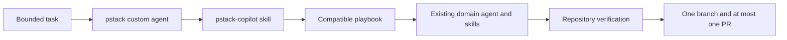

# pstack integration for GitHub Copilot cloud agent

## Purpose

pstack is an optional orchestration mode for a single GitHub Copilot cloud-agent task. It adds playbook selection, explicit verification, and bounded delegation without replacing this repository's existing agents, skills, or instructions.

Default Copilot tasks continue to use the routing in [the repository instructions](../.github/copilot-instructions.md).

## Selecting pstack

The `pstack` profile is a repository custom agent. After the profile is merged to the default branch:

1. Open the GitHub Copilot Agents panel or assign Copilot to an issue.
2. Select the `pstack` custom agent from the agent dropdown.
3. Select a model and reasoning level when the entry point provides those controls.
4. Submit one bounded task.

The profile is manually invocable and has automatic model invocation disabled. Typing "use pstack" while leaving the default agent selected is not the supported activation path.

## Execution model

The [pstack agent profile](../.github/agents/pstack.agent.md) is the cloud entry point. The [Copilot compatibility skill](../.github/skills/pstack-copilot/SKILL.md) defines precedence, playbook support, delegation, and quarantine rules. Vendored pstack files remain source material until each capability is adapted or quarantined.

## Precedence

The selected pstack agent follows this order:

1. GitHub Copilot cloud-agent platform and security constraints.
2. [Repository instructions](../.github/copilot-instructions.md).
3. Applicable path-specific instructions.
4. Existing repository domain agents and skills.
5. The pstack Copilot compatibility skill.
6. Portable upstream pstack guidance.

The repository's clarification rule overrides pstack's `never-block-on-the-human` principle when requirements are unclear. Existing API, schema, metrics, frontend, integration, observability, testing, and pipeline skills remain authoritative for their domains.

Spec-driven development and `speckit` are intentionally separate. Selecting pstack does not invoke those workflows.

## Supported work

The initial compatibility layer supports investigation, bug fix, bounded performance work, runtime or trace diagnosis with available evidence, feature implementation, refactoring, prototypes, visual parity, skill authoring, evaluations with a repeatable harness, and multi-phase planning that produces independently assignable tasks.

Copilot cloud agent works on one branch, creates at most one pull request for a task, and has a finite session. Requests must be sized accordingly.

## Quarantined work

Persistent or multi-branch pstack workflows are not available in the cloud profile:

- PR-stack babysitting and shipping.
- Autonomous or multi-day loops.
- Orchestrate and autopilot programs.
- Cursor transcript pickup and pause/resume state.
- Worktree cleanup.
- Bun orchestration, Origin, Graphite, Cursor Routines, and Cursor plugin control flows.

For these requests, pstack should explain the constraint and propose bounded cloud tasks rather than simulate unsupported persistence.

## Validation

After changes to the integration:

1. Confirm the `pstack` profile appears in GitHub's custom-agent selector after reaching `master`.
2. Confirm ordinary tasks do not select it automatically.
3. Run a read-only investigation task.
4. Run one backend or frontend task and verify delegation uses the owning repository agent and applicable path instructions.
5. Confirm focused tests run before broader checks.
6. Request a quarantined workflow and confirm it produces a bounded decomposition.

Track capability-level progress in the [porting status](pstack-porting-status.md).